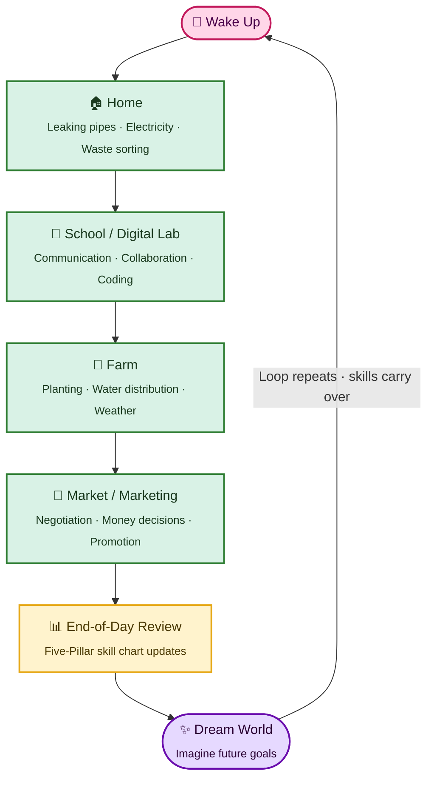
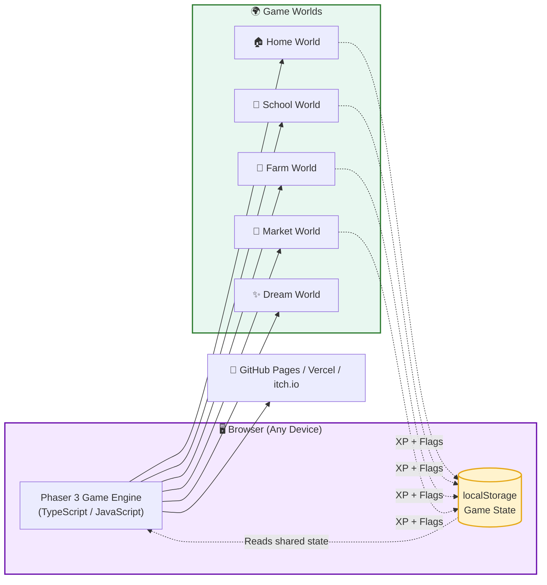

<div align="center">


<br/>

# 🎮 SkillVerse

### *Live a Day. Learn a Life.*

**A browser-based life-simulation game that turns everyday decisions into real-world skills.**

Built for **IEEE WIE ILS 2026 National Hackathon** — *Empower to Inspire: Thriving Together for an Inclusive and Sustainable Future*

<br/>


</div>

<br/>

## 🌸 Table of Contents

- [What is SkillVerse?](#-what-is-skillverse)
- [The Problem](#-the-problem)
- [World Previews](#-world-previews)
- [How It Works](#-how-it-works)
- [The Five Pillars](#-the-five-pillars-skill-dashboard)
- [What Makes It Different](#-what-makes-it-different)
- [System Architecture](#-system-architecture)
- [Tech Stack](#-tech-stack)
- [Roadmap / Build Milestones](#-roadmap--build-milestones)
- [Expected Impact](#-expected-impact)
- [Team](#-meet-the-team)
- [Getting Started](#-getting-started)
- [License](#-license)

<br/>

## 🌱 What is SkillVerse?

> SkillVerse is a **web-based life-simulation game** where a child lives one complete virtual day — waking up, doing chores, attending school, tending a farm, selling goods at the market, and reflecting at night on what they've learned.

Instead of quizzes and textbook recall, players are dropped into realistic scenarios — *a leaking pipe, a scarce water source, a tough negotiation* — and must **choose**. Every choice has a visible, lasting consequence on their character, their world, and their evolving skill profile.

**Learning happens through experience, not instruction.** 🌟

<br/>

## 🎯 The Problem

Children learn concepts in class but rarely get the chance to *practice* them — decision-making, money management, digital literacy, sustainability, and entrepreneurial thinking are all skills built through repetition, not memorization.

This gap is echoed by real frameworks, not just our assumption:

| Source | What it says |
|---|---|
| 🇮🇳 **NEP 2020** | Mandates experiential & vocational learning from Grade 6 onward |
| 🏛️ **Ministry of Education** | Calls for vocational education to be more accessible, flexible & inclusive |
| 🌍 **UNICEF India** | Identifies decision-making, empathy, teamwork & goal-setting as core life skills best learned through real practice |

SkillVerse gives children a **safe, low-risk sandbox** to make decisions, see consequences, and learn from mistakes — right when habits are forming (ages 11–14).

<br/>

## 🖼️ World Previews

> 🎨 *Mockups below are placeholder art — final in-game visuals are being built in Phaser 3.*

<table>
<tr>
<td align="center" width="33%">

<br/><b>🏠 Home World</b><br/><sub>Leaking pipes · Waste sorting · Safety</sub>
</td>
<td align="center" width="33%">

<br/><b>🏫 School World</b><br/><sub>Coding · Teamwork · Communication</sub>
</td>
<td align="center" width="33%">

<br/><b>🌾 Farm World</b><br/><sub>Planting · Water budgeting · Weather</sub>
</td>
</tr>
<tr>
<td align="center" width="33%">

<br/><b>🛒 Market World</b><br/><sub>Negotiation · Pricing · Promotion</sub>
</td>
<td align="center" width="33%">

<br/><b>✨ Dream World</b><br/><sub>Imagine future goals & passions</sub>
</td>
<td align="center" width="33%">

<br/><b>📊 Skill Dashboard</b><br/><sub>Five-pillar end-of-day review</sub>
</td>
</tr>
</table>

<br/>

## 🔄 How It Works

Every phase follows the same loop: **situation → decision → result → visible effect.**



The magic: skills and consequences **carry over** between worlds. A water-management mistake on the Farm can ripple into the Market. Nothing resets — the child is building *one persistent character*, not five disconnected mini-games.

<br/>

## 🌈 The Five Pillars (Skill Dashboard)

Success isn't tracked with marks — it's tracked across five growing skill pillars, visible to the child, parents, and teachers alike.

| Pillar | Icon | Built Through |
|---|:---:|---|
| **Life Skills** | 🧭 | Home chores, safety decisions, waste sorting |
| **Human Skills** | 🤝 | Teamwork, communication, empathy at School |
| **Digital Skills** | 💻 | Coding puzzles, typing, debugging in the Digital Lab |
| **Vocational Skills** | 🌾 | Farming, resource & water budgeting |
| **Entrepreneurial Skills** | 💰 | Negotiation, pricing, marketing at the Market |

<br/>

## 💡 What Makes It Different

<table>
<tr><th>Existing Solution</th><th>Approach</th><th>Where SkillVerse Goes Further</th></tr>
<tr><td>🧱 <b>Minecraft Education</b></td><td>Open-ended creative 3D platform</td><td>Replaces open sandbox with a <b>directed, consequence-driven</b> journey and a unified skill profile</td></tr>
<tr><td>🎬 <b>UNICEF CRIIIO 4 GOOD</b></td><td>Guided, curated animated content</td><td>Turns passive content into <b>repeated, playable scenarios</b> with real-time consequences</td></tr>
<tr><td>❓ <b>Quiz-based EdTech</b></td><td>Question → Answer → Score</td><td>Replaces the loop with <b>Situation → Decision → Consequence → Skill Growth → Reward → Progression</b></td></tr>
</table>

**The core innovation:** a **shared cross-world state** — a persistent architecture where your choices on the Farm genuinely affect your outcomes in the Market. One character. One evolving story. Real trade-offs.

<br/>

## 🏗️ System Architecture



No backend, no paid APIs, no special hardware — it runs entirely client-side in a browser.

<br/>

## 🛠️ Tech Stack

<div align="center">


</div>

| Layer | Choice | Why |
|---|---|---|
| **Game Engine** | Phaser 3 | Mature, browser-native, built-in physics & animation |
| **Logic** | JavaScript / TypeScript | Fast iteration, huge ecosystem |
| **Persistence** | Browser `localStorage` | Zero backend cost, works offline |
| **Hosting** | GitHub Pages / Vercel / itch.io | Free, one-URL deployment |
| **AI/IoT** | ❌ None (by design) | Keeps the prototype lightweight, portable & reliable |

<br/>

## 🗓️ Roadmap / Build Milestones

```mermaid
gantt
    dateFormat  X
    axisFormat %s h
    section Hackathon Build (36h)
    Setup core data, UI, repo         :m1, 0, 4h
    Build world mechanics             :m2, after m1, 14h
    Full integration & playtest       :m3, after m2, 4h
    Bug fixes & accessibility polish  :m4, after m3, 12h
    Final testing & demo prep         :m5, after m4, 2h
```



| Risk | Mitigation |
|---|---|
| 🔗 Integration failure across 5 worlds | Lock shared game-state schema upfront; integrate at hour 18, not the end |
| 📈 Scope creep | Hard cap: 2–4 mechanics per world |
| 🎨 Inconsistent mechanics | Shared UI kit + one branch per world with PR merges |
| 📡 Unreliable network | Maintain a working local build at all times |

<br/>

## 🌍 Expected Impact

- 🎒 **Primary users:** School children (11–14 initially, expanding to ages 3–16)
- 👩‍🏫 **Secondary users:** Teachers & parents, via a live skill-progress dashboard
- 🌐 **Access:** Runs on any browser — school lab PC, classroom laptop, or home phone. No install, no high-speed internet required
- 🏘️ **Reach:** Urban, semi-urban, and resource-constrained communities alike

**Key metrics we'll track:** completion rate · repeat-session rate · skill transfer to real tasks · five-pillar growth · learner sentiment · educator feedback.

<br/>

## 👩‍💻 Meet the Team — *The CodeX*

**Sardar Vallabhbhai National Institute of Technology · Surat, Gujarat**

| Avatar | Member | Role | Owns |
|:---:|---|---|---|
|  | **Samridh Sethi** *(Lead)* | 🏫 School World Lead | Communication & Digital Lab: body-language challenge, teamwork game, typing & coding puzzles |
|  | **Shiva Shankar Malekar** | 🏠 Home World Lead | Water-leak event, electrical-safety decisions, waste-sorting |
|  | **Shaurya Prajapati** | 🌾 Farm World Lead | Crop grid, water-budget allocation, weather events, sustainability dashboard |
|  | **Arpita Soholkar** | 🛒 Market World Lead | Sell-to-buyer flow, negotiation mini-game, profit calculation |
|  | **Lavanya Choukiker** | 📣 Marketing Lead | Ad creation, packaging mini-games, customer-reaction scoring |
|  | **Shreya Patil** | ⚙️ Systems & Integration Lead | Shared game-state schema, day loop, XP/coins/badges |

<br/>

## 🚀 Getting Started

```bash
# clone the repo
git clone https://github.com/<your-org>/skillverse.git
cd skillverse

# install dependencies
npm install

# run locally
npm run dev
```

Then open the local URL in your browser and start your first in-game day! 🌅

<br/>

## 📜 License

This project is submitted for the **IEEE WIE ILS 2026 National Hackathon**. License to be finalized by the team — MIT recommended for open collaboration.

<br/>

<div align="center">

### 🌸 *Powering Solutions. Empowering Women. Shaping Tomorrow.* 🌸

Made with 💜 by **Team The CodeX**

</div>
